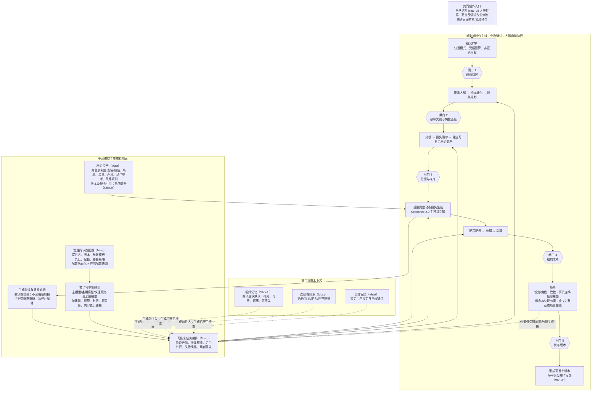

---
tags:
  - ai-video
  - AI漫剧
  - 技术架构
date: 2026-07-13
title: AI漫剧创作平台技术架构一页纸
---

# AI 漫剧创作平台：技术架构一页纸

> **架构目标**：面向缺乏影视经验的创作者，以共同创作方式，快速把一句 idea 兑现为**故事完整、全片动态、设定一致**且让用户有创作者归属感的 AI 漫剧。本文只定义逻辑职责、边界与控制点，不预设具体技术栈。

## 三项最高控制维度

| 维度 | 前置控制 | 执行控制 | 结果控制 |
|---|---|---|---|
| **质量** | 创作宪法、连续性账本、角色圣经、剧组资产 | 每阶段注入约束；连续性守卫；模型兼容性与质量底线 | 故事弧完整；悬念与兑现循环；全片完整动态；发布前质检 |
| **效率** | 概念样片尽早验证方向；五个高返工风险闸门 | 后台并行、阶段持续预览、资产复用、可恢复编排 | 局部重做而非全量返工；随时无损续作，始终接近可发布版本 |
| **成本** | 样片使用受控预算与快速模式 | 节点策略组动态路由；缓存；资产复用；配置快照与成本统计 | 只重生成受影响范围；预算不足时可降镜头复杂度，但不得截断故事或降级为动态漫画 |

## 首版边界

| **Must：形成 idea 到完整漫剧的最小闭环** | **Should：增强控制、个性化与运营闭环** |
|---|---|
| 共同创作入口与概念样片；故事/脚本/分镜；创作宪法、连续性账本与基础剧组资产一致性；以 **Seedance 2.0** 为主引擎的全片完整动态镜头生产；配音配乐、剪辑、字幕与可发布版本；可恢复任务编排、局部重做与管理员节点模型配置 | 偏好记忆及使用透明度；悬念比例与兑现节奏配置；模型策略组高级路由；资产变更影响分析；多平台发布与反馈 |

**明确不进入首版**：专业非线性剪辑器、通用工作流搭建器、默认全自动公开发布、以动态漫画替代完整动态成片。多人协作、资产市场、IP 衍生、A/B 与智能成本优化留作 Could。
