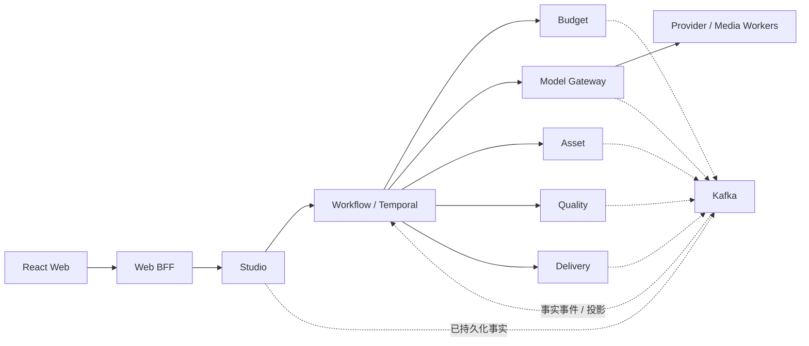
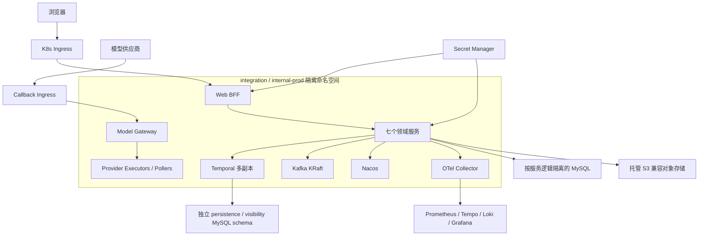

# Architecture Spine — AI 漫剧创作平台

## Design Paradigm

采用**按业务事实划分的限界上下文微服务 + Temporal 持久化工作流编排 + 控制面/执行面分离**。领域服务独占业务事实，Temporal 独占流程推进，执行 Worker 只完成幂等任务尝试并返回不可变结果。



## Invariants & Rules

### AD-1 — [ADOPTED] 事实所有权按限界上下文唯一归属

- **Binds:** FR-1..FR-25，全部核心服务
- **Prevents:** 多个服务写同一业务真相、按 UX 阶段或模型节点任意拆分服务
- **Rule:** Studio、Workflow、Budget、Asset、Model Gateway、Quality、Delivery 各自独占写模型和数据库身份；禁止跨服务 SQL、外键、共享表和写入。平台支撑与 Worker 不成为新的核心事实源。

| 唯一事实拥有者 | 聚合/记录 |
| --- | --- |
| Studio | Project、Revision、CreativeConstitution、ChangeProposal/ImpactPlan/ProposalConfirmation、GateApproval、FinalReleaseConsent、InteractionReceipt |
| Workflow | WorkflowRun、LogicalTask、WorkflowInbox、Saga/补偿游标 |
| Budget | PricingQuote 验证结果、Reservation、SpendAuthorization/Receipt、BudgetLimitRevision、LedgerEntry |
| Asset | AssetSlot、ArtifactVersion、AdoptionRecord/Manifest、DependencyManifest、ArtifactRegistrationReceipt |
| Model Gateway | ModelProfile/ConfigSnapshot、Attempt、ModelTask、ProviderCostFact、供应商删除请求 |
| Quality | RuleSet、QualityRun、Finding、Evidence、WarningAcceptance、QualityEligibilityAttestation |
| Delivery | ReleaseCandidateManifest、ReleaseVersion、ExportRecord |

### AD-2 — [ADOPTED] Temporal 是唯一流程推进器

- **Binds:** FR-11..FR-20，NFR-1..NFR-4、NFR-16
- **Prevents:** Temporal、Kafka、浏览器和回调各自推进阶段造成分叉
- **Rule:** 长流程、等待、重试和补偿只能由 Temporal Workflow 推进；Kafka 只传播已持久化事实。所有外部事实仅由 `workflow-signal-bridge` 进入 Temporal：先以 `event_id + target_workflow_id` 持久化 WorkflowInbox，再发送带同一 dedupe key 的 Signal，Workflow 记录已消费 key 后才推进；领域服务和 BFF 禁止直接 Signal 业务 Workflow。

### AD-3 — [ADOPTED] 编排状态与业务事实分离

- **Binds:** Studio、Workflow、Budget、Asset、Quality、Delivery
- **Prevents:** Workflow 演变为项目、预算、采用版本或 Release 的影子事实源
- **Rule:** Workflow 只保存流程游标、等待信号、活动结果引用和补偿状态；项目阶段、确认、账本、资产采用、质量判定和 Release 仍由各事实拥有服务决定。

### AD-4 — [ADOPTED] 跨服务一致性采用 Saga + Outbox/Inbox

- **Binds:** 全部跨服务命令与事件，NFR-1..NFR-3
- **Prevents:** 2PC、双写、重复消费和消息丢失导致业务事实不一致
- **Rule:** 用户命令同步进入事实拥有服务；跨域推进采用 orchestration-first Saga。状态与 Outbox 同一 MySQL 事务，领域 Inbox 或 WorkflowInbox 去重与业务更新同一事务，传输语义为 at-least-once；禁止分布式事务。一个事实事件只有一个 Workflow Ingress 路径。

### AD-5 — [ADOPTED] 契约 Proto-first 且只做兼容演进

- **Binds:** 同步 API、Kafka 领域事件、所有服务模块
- **Prevents:** 共享业务代码、隐式 JSON 形状和破坏性升级造成调用方漂移
- **Rule:** 同步 API 与事件均由事实拥有服务维护版本化 Proto；v1 只允许兼容新增，破坏性变更并行发布 v2。业务 enum 的 0 值必须为 `UNSPECIFIED` 且消费者 fail-closed；有缺失语义的 scalar 使用 optional/oneof；删除字段/枚举号必须 reserved。CI 运行 breaking check、producer/consumer golden vectors 和 unknown enum/field 测试。Kafka 首版使用 protojson，Topic 为 `ai-video.<env>.<domain>.events.v1`，key 为 `aggregate_id`；事件不携带媒体或大文本。

### AD-6 — [ADOPTED] 身份、修订、阶段和采用分离建模

- **Binds:** FR-1..FR-10、FR-13..FR-20
- **Prevents:** 一个组合状态机同时表达流程、内容版本和采用关系而失控
- **Rule:** 所有跨服务实体使用全局不透明 ID 和 `workspace_id`；聚合以单调 `aggregate_version` 乐观并发。Project 的 `phase` 与 `lifecycle` 分离，内容 revision、AssetSlot 当前采用指针、Attempt、Gate、QualityRun、Reservation、ReleaseVersion 各自维护状态机。

### AD-7 — [ADOPTED] 生成候选不可变，采用必须显式

- **Binds:** FR-3、FR-6、FR-9、FR-14..FR-20
- **Prevents:** 新生成结果或质量通过静默覆盖创作者已确认版本
- **Rule:** ArtifactVersion、内容 Revision、Quality Evidence、GateApproval 和 ReleaseVersion 追加写；生成和质量通过只产生候选。单 Slot AdoptionCommand 必须携带 `slot_id`、`expected_slot_aggregate_version`、`expected_adopted_artifact_version_id` 与目标版本；多 Slot 使用按 slot_id 排序的 ExpectedAdoptionVector，Asset 在一个本地事务全验全改，任一冲突则全部拒绝。

### AD-8 — [ADOPTED] 模型调用只有一个出口

- **Binds:** FR-2..FR-19，NFR-2、NFR-8、NFR-14、NFR-16
- **Prevents:** 各服务直接调用供应商、配置漂移、凭证扩散和重复扣费
- **Rule:** 所有生成和 AI 评价只经 Model Gateway；每个 Attempt 锁定不可变 ModelConfigSnapshot、PricingQuote 和 CostPolicySnapshot。Studio、Workflow、Quality、Delivery 与 Worker 不得读取供应商凭证或绕过该出口。

### AD-9 — [ADOPTED] 供应商提交受理必须三态

- **Binds:** FR-13..FR-16，NFR-2、NFR-16
- **Prevents:** 超时后盲目重放 POST，造成重复生成与重复扣费
- **Rule:** 提交只能落为 `NOT_ACCEPTED`、`ACCEPTED` 或 `UNKNOWN`。`UNKNOWN` 进入对账并保持预算；禁止自动重放。备用模型只在 `NOT_ACCEPTED` 且策略允许时，以新 Attempt、Reservation 和 Snapshot 切换。

### AD-10 — [ADOPTED] 供应商成功不等于平台任务完成

- **Binds:** FR-13..FR-20，NFR-3、NFR-14
- **Prevents:** 外部临时 URL 丢失、未经校验媒体进入下游
- **Rule:** Asset 以 `attempt_id + provider_result_id + checksum` 幂等登记，只有 canonical object、checksum/媒体探测通过且 ArtifactVersion 为 `AVAILABLE` 时签发 ArtifactRegistrationReceipt。Model Gateway 持久化该 Receipt 后才可完成 ModelTask；重复登记返回同一 Receipt。转存失败停在 `TRANSFERRING` 重试，不重新生成。

### AD-11 — [ADOPTED] 付费尝试先预留、后提交、按事实结算

- **Binds:** FR-11..FR-16、FR-23，SM-10..SM-15
- **Prevents:** 超预算提交、未知计费提前释放、浮点误差和历史账本改写
- **Rule:** 跨服务金额只使用 Money Proto：ISO 4217 `currency_code`、`minor_units int64`、`currency_exponent`，禁止 JSON number、float 和服务私有 Decimal；舍入由版本化 RoundingPolicy 决定。Budget 以 Attempt 幂等原子预留最大责任并签发单次 SpendAuthorization，绑定 workspace、attempt、reservation、quote/cost-policy digest、最大责任、币种、独立过期时间与 nonce。Model Gateway 提交前命令 Budget 原子将授权从 `ISSUED` 转为 `CONSUMED` 并取得 SpendAuthorizationReceipt；持久化回执后才可提交。相同 `authorization_id + attempt_id + nonce` 的消费重试必须返回同一不可变 Receipt；只有绑定不一致、过期且尚未消费，或被不同幂等键消费时拒绝。预算占用按 `settled + active max liability` 计算，跨过 70%/90% 时分别发布一次单调提醒事件，达到 100% 停止新增付费任务。`ACCEPTED` 或计费未知时保持 `HELD_RECONCILING`，ProviderCostFact 追加结算，超额由平台承担。

### AD-12 — [ADOPTED] 质量门以版本化证据判定

- **Binds:** QG-1..QG-6，FR-10、FR-15、FR-18..FR-20
- **Prevents:** 总分掩盖阻断项、输入变化后复用失效证据、AI 自行越权阻断
- **Rule:** QualityRun 锁定完整输入闭包的 ManifestRef/content digest、规则集、评估器和证据版本；任一引用变化即失效，重检新建 Run。发布资格签发时必须重新验证 digest 相等且闭包无 stale，事件失效仅用于提示和加速。QG-1..QG-6 分开判定；确定性检查可自动阻断，AI 语义 Finding 必须经指定人工角色复核后才能成为 Blocker。

### AD-13 — [ADOPTED] Asset 独占媒体规范化与血缘

- **Binds:** FR-3、FR-9、FR-14..FR-20，NFR-9..NFR-12
- **Prevents:** 服务各自生成对象键、覆盖媒体、跨 workspace 误复用和血缘断裂
- **Rule:** 其他服务只获得短期 staging 上传权限；Asset 唯一校验、登记 canonical key 和 ArtifactVersion。所有字幕、混音、转码、缩略图、封装都创建引用父版本与 recipe/tool snapshot 的新版本；跨 workspace 禁止仅按 checksum 自动复用。

### AD-14 — [ADOPTED] Release 与 Export 分离且不可变

- **Binds:** FR-19、FR-20、FR-22、FR-23，QG-1..QG-6
- **Prevents:** 导出过程改变已确认内容、质量证据与采用版本不在同一快照
- **Rule:** Workflow 编排 PrepareRelease Saga；Asset、Quality、Studio 分别对同一 ReleaseCandidateManifestRef 和 expected aggregate versions 签发短期 attestation，Studio 签发 FinalReleaseConsent 与 ReleaseAuthorization。Delivery 仅在所有 attestation 的 manifest id/digest 一致且未过期时创建不可变 ReleaseVersion，并记录其 IDs；每次导出新建 ExportRecord，不修改 Release 或采用指针。

### AD-15 — [ADOPTED] 信任边界由 BFF、领域授权和短期凭证共同执行

- **Binds:** FR-12、FR-21..FR-25，NFR-8..NFR-13
- **Prevents:** 浏览器令牌泄露、伪造 workspace、BFF 越权代表领域授权
- **Rule:** 用户认证采用 OIDC，浏览器只持 Secure HttpOnly SameSite Session Cookie，令牌留在 BFF。内部调用携带短期签名服务或委托身份；`workspace_id` 从可信身份和成员关系推导，领域服务执行资源级授权。密钥仅存 Secret Manager，媒体仅用短期最小权限 URL。

### AD-16 — [ADOPTED] 敏感数据删除必须可验证且受保留约束

- **Binds:** FR-21..FR-25，NFR-9..NFR-12
- **Prevents:** 只删数据库指针、遗漏供应商副本或删除受法律保留保护的证据
- **Rule:** Studio 接收删除意图并启动删除 Saga；Asset 负责 tombstone、引用和保留检查，Model Gateway 负责供应商删除请求与回执，审计仅保留非敏感证明。法定保留、Release 引用与调查保全优先于物理删除，状态与未完成责任必须可见。

### AD-17 — [ADOPTED] 指标投影不成为事实源

- **Binds:** SM-1..SM-15，NFR-14、NFR-15
- **Prevents:** 只统计成功项目、分析库回写业务状态、质量效率成本口径不可关联
- **Rule:** 指标由领域事件构建只读投影，禁止反向修改业务事实；workspace、project、workflow、logical_task、attempt、release 和 trace 必须可关联。成功、失败、预算终止、治理阻断与用户放弃全部进入分母。

### AD-18 — [ADOPTED] 故障时按业务风险 fail-closed

- **Binds:** NFR-1..NFR-4、NFR-16，QG-1..QG-6
- **Prevents:** 基础设施故障时静默越过预算、质量或资产持久化边界
- **Rule:** Budget、供应商并发控制、质量闸门和对象持久化不可用时停止新增付费推进；Temporal/Kafka 故障暂停跨域生产但保留本地事实；通知与分析可积压补偿。Kafka 不是业务事实备份。

### AD-19 — [ADOPTED] ag-core 服务保持独立生成与构建边界

- **Binds:** web-bff 与七个核心服务的代码库、CI/CD
- **Prevents:** monorepo 退化为共享内部包、生成代码被手改、go.work 掩盖独立构建失败
- **Rule:** 单 Git monorepo 内每个服务是独立 Go Module、镜像和部署单元；ag-core 的规范来源是 `https://github.com/aif-go/ag-core.git`，module/import 统一为 `github.com/aif-go/ag-core`。开发可通过可配置的本地 checkout + go.work/use 解析；CI 只能检出 `技术基线锁定.md` 中远端可达的不可变 ref+SHA，并脱离 ai-video 的 go.work 独立构建。禁止使用 `gitlab.allinfinance.com/aifgo/ag-core` 版框架与生成器。Proto-first、aggo 与 fx 装配；禁止修改生成目录和跨服务 import 其他服务 `internal`/repository/model/DAO。

### AD-20 — [ADOPTED] 付费自然语言动作必须二次显式授权

- **Binds:** FR-4、FR-11..FR-17，全部 AI 共创入口
- **Prevents:** 聊天文本被直接解释为付费命令，或确认时输入、影响范围和价格已变化
- **Rule:** Studio 独占不可变 ChangeProposal、ImpactPlan 与 ProposalConfirmation，至少记录目标对象、锁定输入、影响范围、最大计费责任、预计时长、Quote 到期时间与 expected versions。显式确认在 Studio 持久化并发布事实，经唯一 Workflow Ingress 推进；Workflow 创建 AttemptIntent，Model Gateway 幂等创建 `PENDING_AUTHORIZATION` Attempt，Budget 以其 ID 预留并签发授权，随后按 AD-11 消费。Workflow 只保存引用，不创建或复制 Attempt 状态；自然语言本身永远不是扣费授权。

### AD-21 — [ADOPTED] Web 工作台只消费统一体验读模型

- **Binds:** FR-1..FR-20，NFR-5、NFR-6
- **Prevents:** Web/BFF 轮询多个领域服务并各自推导阶段、阻断、预算和预览状态
- **Rule:** 独立部署的 `experience-projection` 是 `ProjectExperienceView` 与 Notification Projection 的唯一 owner，订阅领域 Topic 并使用独立派生数据库。每个 ViewRevision 携带 projection revision、各源 aggregate version/event watermark、computed_at 与 staleness reason；UX 状态由版本化 ExperiencePolicy 穷举映射。SSE 游标只代表投影日志位置；写命令仍携带事实 owner 的 expected version。

### AD-22 — [ADOPTED] 依赖图决定失效、最小重做与复用

- **Binds:** FR-8..FR-10、FR-14、FR-16..FR-19，SM-9、SM-12
- **Prevents:** 上游改变后漏重做、无影响内容被全量重生成、不同服务计算出不同影响范围
- **Rule:** Revision 与 ArtifactVersion 引用版本化 DependencyManifest；上游变化按明确边类型传播 `stale` 并记录原因。只有输入、配置、规则、工具和锁定结果均相同时才可复用。跨画面、音轨、字幕的局部重做以 AdoptionManifest 对 expected current manifest 原子切换，撤销也追加记录。

### AD-23 — [ADOPTED] 五类常规 Gate 拓扑固定

- **Binds:** FR-2、FR-5..FR-7、FR-11、FR-18..FR-20
- **Prevents:** Studio、Workflow 与 Quality 对“何时必须停下确认”各自建模
- **Rule:** Studio 固定 `CREATIVE_BRIEF`、`STORY_AND_CHARACTER`、`STORYBOARD_AND_SAMPLE`、`ROUGH_CUT`、`INTERNAL_RELEASE` 五类 Gate；每个 Gate 引用精确前置 Manifest、Quality Evidence、actor 和 expected project version。批准与 Project 状态转换在 Studio 同一事务持久化并经 Outbox 发布事实，只能由 `workflow-signal-bridge` 转为 Signal；未批准不得启动依赖它的高成本批量生成。

### AD-24 — [ADOPTED] 内部交付规格由单一版本化 Profile 判定

- **Binds:** FR-19、FR-20、FR-22，QG-6
- **Prevents:** Asset、Quality 与 Delivery 对“可导出”及文件形态各自定义
- **Rule:** 内部 `DeliveryProfile` 固定 9:16、1080×1920、30fps、MP4/H.264、AAC 48kHz、字幕烧录与独立字幕文件、可见 AI 标识与可验证元数据。Asset 保存 duration/fps/timebase/镜头边界/字幕 cue 等规范化元数据；不合规输入必须产生新转码版本，QG-6 与 Export 引用同一 Profile 版本。

### AD-25 — [ADOPTED] 敏感数据准入与保留由策略快照约束

- **Binds:** FR-21..FR-25，NFR-9..NFR-12
- **Prevents:** 敏感素材发送给条款不合格供应商、各服务采用不同删除和审计期限
- **Rule:** 每次敏感数据处理锁定 `DataPolicySnapshot` 与 `ProviderEligibilityPolicy`；Model Gateway 提交前验证禁训练、保留、删除传播与区域资格。平台控制范围内敏感原始素材删除目标为项目删除后 30 天，内部审计记录最低保留 180 天；例外、法定保全和供应商删除结果必须可审计。

### AD-26 — [ADOPTED] 模型回退必须满足能力契约

- **Binds:** FR-12、FR-15、FR-16，QG-2、QG-4，NFR-16
- **Prevents:** 仅因延迟切换模型、备用模型输入输出不兼容或降低完整动态与连续性底线
- **Rule:** ModelProfile 发布版本化 CapabilityContract、QuotaPolicy 和 FallbackPolicy。回退除满足 AD-9 外，还必须证明输入形态、输出元数据、完整动态和连续性约束兼容，并记录决策证据；不兼容时暂停并说明。运行中 Snapshot 不受配置发布、停用或修改影响。

### AD-27 — [ADOPTED] 统计队列和阈值只能追加与冻结

- **Binds:** SM-1..SM-15，NFR-15
- **Prevents:** 事后剔除失败项目、回写复杂度、不同报表使用不同校准样本和阈值
- **Rule:** 分析事实使用不可变 CohortMembership、ComplexityPolicySnapshot、ComplexitySnapshot 与 MetricPolicySnapshot。正式生产前按集数/总时长/主要角色/主要场景固定：简单型分别 ≤5/≤5 分钟/≤3/≤3；中等型分别 ≤10/≤10 分钟/≤6/≤6；任一超过中等上限即复杂型，Snapshot 保存原始输入与策略版本。项目连续纳入并以五类终态收口；前 20 部按层校准 p75，第 21 部前冻结，单层少于 5 部不得声称完成校准。

### AD-28 — [ADOPTED] 暂停只停止新调度，不抹消在途责任

- **Binds:** FR-13、FR-16，NFR-1、NFR-2、NFR-6、NFR-16
- **Prevents:** 暂停后丢失已受理供应商任务、错误释放预算或恢复时重复执行
- **Rule:** 明确区分 `USER_PAUSED`、`BUDGET_PAUSED`、`BLOCKED`、`WORKFLOW_STALLED`。暂停停止新 Activity 调度；已 `ACCEPTED`/`UNKNOWN` 的 Attempt 继续对账、转存和结算但不自动推进采用；恢复从持久化 Workflow 游标和最新领域版本继续。

### AD-29 — [ADOPTED] 质量覆盖权限是版本化策略

- **Binds:** QG-1..QG-6，FR-19、FR-20
- **Prevents:** 各界面或服务自行决定谁能接受 Warning，或允许覆盖不可覆盖项
- **Rule:** Quality 独占 WarningAcceptance；QG-1 提醒可由创作者接受、Blocker 不可覆盖；QG-2 轻微提醒需创作者与内部审核共同接受，Blocker 必须修改创作宪法后重检；QG-3 的 3 分提醒仅创作者本人接受、低于 3 分必须修改；QG-4 提醒需创作者与内部审核双接受、Blocker 不可覆盖；QG-5 提醒可由创作者接受、Blocker 不可覆盖；QG-6 不可覆盖。Acceptance 绑定 quality_run/evidence、actor、role、scope、reason、time；Studio Gate 只引用 acceptance IDs。MVP 叙事节奏由 Studio 的 NarrativePolicySnapshot 定义，生成与 Quality 检查引用同一版本。

### AD-30 — [ADOPTED] 产品 SLO 与可访问性进入发布门

- **Binds:** NFR-4、NFR-5、NFR-7
- **Prevents:** 团队采用不同可用性与延迟口径，或把无障碍留到发布后人工补救
- **Rule:** Studio 拥有版本化 SLI Catalog；控制面月可用性以 BFF→领域服务的非供应商命令/查询成功率计算，排除计划维护和外部供应商等待，目标 99.5%；Catalog 同时列出主要非生成交互并要求 p95 ≤ 2 秒。Web 必须通过 WCAG 2.1 AA 核心检查、键盘路径、非颜色单一编码、对比度与 `prefers-reduced-motion` 自动化门禁。

### AD-31 — [ADOPTED] 跨作品任务与提醒由持久化投影提供

- **Binds:** FR-13、FR-16、FR-19，NFR-6、NFR-16
- **Prevents:** 只有浏览器在场时才能收到结果，或至少一次事件产生重复任务与提醒
- **Rule:** Studio 独占追加式 InteractionReceipt（read/ack）；`experience-projection` 从领域事实与 Receipt 构建跨作品任务，使用 canonical DecisionTaskRef（type、owner domain、aggregate id/version、decision id）和 `event_id + recipient + notification_type` 去重。ProjectExperienceView 与通知中心投影同一 TaskRef；投影可重建且不得推进 Workflow。

### AD-32 — [ADOPTED] 跨域 Manifest 使用统一内容寻址引用

- **Binds:** DependencyManifest、AdoptionManifest、Gate 输入、QualityRun、ReleaseCandidateManifest
- **Prevents:** 各服务采用不同排序、空值、引用闭包或哈希算法，将不同内容判为相同或相同内容判为不同
- **Rule:** 跨域只传不可变 ManifestRef：`manifest_id`、`manifest_type`、`schema_version`、`owner_domain`、`content_digest`、`created_at`。`contracts/manifest/v1` 固定每类 Manifest 的 owner、必填成员、排序、重复项、空值、引用闭包与确定性 protobuf canonicalization，并提供 golden vectors；“同一 Manifest”要求 id 与 digest 同时相等。

### AD-33 — [ADOPTED] 跨服务演进必须保持双版本兼容窗口

- **Binds:** 数据库、Proto/API、Kafka 事件、Temporal Workflow、镜像与配置发布
- **Prevents:** 任一服务独立升级后旧消费者、在途 Workflow 或回滚版本无法工作
- **Rule:** 采用 expand → migrate → contract：先部署向后兼容读写，再迁移数据/流量，最后仅在旧版本与在途 Workflow 清零后收缩。数据库迁移禁止与仅新代码同批不可逆发布；Temporal 使用显式 Workflow versioning/Worker deployment；镜像和配置可独立回滚。告警、容量、背压、密钥轮换、恢复与回滚演练均为 internal-prod 放行证据。

## Consistency Conventions

| Concern | Convention |
| --- | --- |
| ID 与时间 | 全局不透明 ID；UTC RFC 3339 时间；跨服务不建外键 |
| 事件 Envelope | `event_id`、`schema_version`、`workspace_id`、`aggregate_id/version`、`correlation_id`、`causation_id`、`idempotency_key`、`occurred_at`、`trace_id` |
| 错误 | 机器可判定错误码 + 可重试分类 + 面向用户的安全文案；供应商原始错误仅进入受控日志/证据 |
| 状态修改 | 仅事实拥有服务接受命令；所有外部副作用以幂等键和持久化 Attempt 保护 |
| 配置 | AgConf 本地/环境/Nacos 分层；业务规则、模型配置、价格和工具链均生成不可变 Snapshot |
| 日志与追踪 | AgLog JSON + OpenTelemetry；日志禁止密钥、token、媒体 URL 和敏感提示词原文 |
| 缓存 | agredis 仅加速派生读模型；缓存丢失不能改变预算、阶段、Workflow 或采用状态 |

## Stack

以下版本是 2026-07-14 的**目标基线，不代表已物化构建**；ag-core 当前只确认 GitHub 工作快照，远端不可变 ref 尚待发布。所有 P0 项记录可恢复版本、镜像 digest、许可证和测试证据，未通过不得执行脚手架或进入 internal-prod。OpenTelemetry 是应用层集成，不是 ag-core 内建能力。

| Name | Version |
| --- | --- |
| Go | 1.25.x（与 GitHub ag-core 的 `go 1.25.0` 基线一致） |
| ag-core | GitHub `github.com/aif-go/ag-core`；本地已验证工作快照 `7bc2f4561a9284728cb92b15b9ae9ee760abfa5c`，远端不可变 ref 待 P0 发布 |
| MySQL | 8.4 LTS |
| Temporal Server / Go SDK | 自托管受支持版本（精确 patch P0 锁定） |
| Kafka | 4.x KRaft（agsarama 全链路后锁定 patch） |
| Nacos | ag-core 兼容版本（P0 锁定） |
| Redis | agredis 兼容版本（P0 锁定） |
| React | 19.2 |
| TypeScript | 5.x（前端锁文件锁定） |
| Vite | 8.1.4 |
| FFmpeg | 8.1.2 镜像锁定 |
| Kubernetes | 1.35（2026-07-14 的受支持 n-1 minor） |
| OpenTelemetry Go | traces/metrics 稳定 API，精确版本由模块锁定 |

## Structural Seed

```text
ai-video/
  api/                     # 共享发布的 Proto 契约，不含业务实现
  services/
    web-bff/               # Hertz HTTP，独立 Go Module
    studio/ workflow/ budget/ asset/ model-gateway/ quality/ delivery/
    experience-projection/   # 唯一体验/通知派生投影，独立数据库
  web/                     # React SPA
  workers/                 # provider/media 类型执行进程，独立镜像
  deploy/                  # compose、k8s、环境配置骨架
  contracts/events/        # 版本化事件 Proto 与兼容性测试
```



内部生产基线：核心 API 双副本；MySQL HA + binlog/PITR；Kafka 三节点 KRaft、RF3、minISR2；Nacos 三节点；对象存储启用版本、加密和跨故障域冗余。Temporal frontend/history/matching 与 Worker 多副本部署，persistence/visibility 使用独立 schema 与账号，各环境独立 Namespace，并通过备份恢复、滚动升级/回滚和 Worker 故障演练。业务元数据 `RPO ≤ 5 分钟`、`RTO ≤ 2 小时`，以恢复演练验证。local 使用 Docker Compose；integration 与 internal-prod 不共享数据库、Topic、Temporal Namespace、Bucket 或 Secret；外部商业化新建生产集群。

## Capability → Architecture Map

| Capability / Area | Lives in | Governed by |
| --- | --- | --- |
| FR-1..FR-10 创意、故事、设定与确认 | Studio、Asset、Quality | AD-1、AD-6、AD-7、AD-12、AD-13、AD-22、AD-23、AD-29 |
| FR-11 计划、报价与预算 | Budget、Workflow、Model Gateway | AD-2、AD-4、AD-11、AD-20、AD-27 |
| FR-12 模型配置 | Model Gateway | AD-8、AD-19、AD-26 |
| FR-13..FR-16 长流程、并行、重做与失败 | Workflow、Model Gateway、Asset | AD-2..AD-4、AD-7、AD-9、AD-10、AD-18、AD-20..AD-23、AD-28、AD-31 |
| FR-17..FR-20 声音、后期、质量与导出 | Asset、Quality、Delivery、媒体 Worker | AD-7、AD-12..AD-14、AD-22..AD-24、AD-29 |
| FR-21..FR-25 权利、标识、审计与治理 | Studio、Asset、Delivery、Model Gateway | AD-14..AD-16、AD-24、AD-25 |
| QG-1..QG-6 | Quality + 各事实拥有服务的修复命令 | AD-7、AD-12、AD-14、AD-23、AD-24、AD-29 |
| NFR-1..NFR-4、NFR-16 可靠性 | Workflow、所有领域服务、平台基础设施 | AD-2..AD-4、AD-9、AD-18、AD-28、AD-30、AD-31 |
| NFR-5..NFR-7 Web 性能与无障碍 | Web、BFF、体验读投影 | AD-21、AD-30、AD-31 |
| NFR-8..NFR-13 安全与数据治理 | BFF、领域服务、Secret Manager | AD-15、AD-16、AD-25 |
| NFR-14..NFR-15、SM-1..SM-15 | 领域事件、观测栈、分析投影 | AD-17、AD-27、Consistency Conventions |

## Deferred

- **Seedance 2.0 生产接入参数**：模型 ID、配额、回调、幂等、取消、计费与删除能力必须在供应商沙箱完成 P0 契约测试后锁定；此前只允许模拟或受控试验流量。
- **GitHub ag-core 可恢复基线与工具链**：当前工作快照 SHA 尚无远端分支包含，且本机已安装的 `aggo`、`gendb`、`protoc-gen-go-ag*` 仍是旧 GitLab 构建。实施前必须先将确认快照发布为 GitHub 远端可达的不可变 tag/ref，再从该 ref 重建全部工具；`go version -m` 必须只显示 `github.com/aif-go/ag-core`，否则禁止运行脚手架。
- **Kafka/Nacos/Redis 兼容版本**：围绕已锁定的 GitHub ag-core commit 做全链路兼容性、滚动升级与故障恢复测试，不在架构层猜测版本。
- **P0 技术锁定产物**：在 `技术基线锁定.md` 记录 GitHub remote、远端可达 immutable ref+SHA、本机验证 checkout、工具链 build metadata 和工作区解析方式，以及 Temporal Server/SDK/schema、Kafka/agsarama、Nacos/Redis、Node/前端 lockfile、FFmpeg 镜像 digest、Kubernetes 发行版/patch；证据缺失即禁止脚手架和 internal-prod。
- **OIDC 身份提供方**：协议和 BFF Session 边界已定，具体 IdP 在安全、采购和内部账号集成评估后选择。
- **托管对象存储供应商**：S3 兼容端口、加密、版本、生命周期与删除证明已定，供应商随部署区域和采购选择。
- **商业化计费、租户套餐与支付**：不属于内部验证版；workspace 隔离键已预留，进入阶段 C 前另建 feature 级架构。
- **Service Mesh、Schema Registry、独立分析仓库**：首版不引入；当服务间安全策略、契约治理或分析负载超过现有边界时重新评估。
- **阶段 C 外部渠道发布与治理 SLA**：内部 MVP 对 FR-24/FR-25 只保留权利、标识、策略与审计承载，不实现投诉、申诉、紧急下架和渠道发布状态机；法务/运营确认后另建 feature 级架构。
