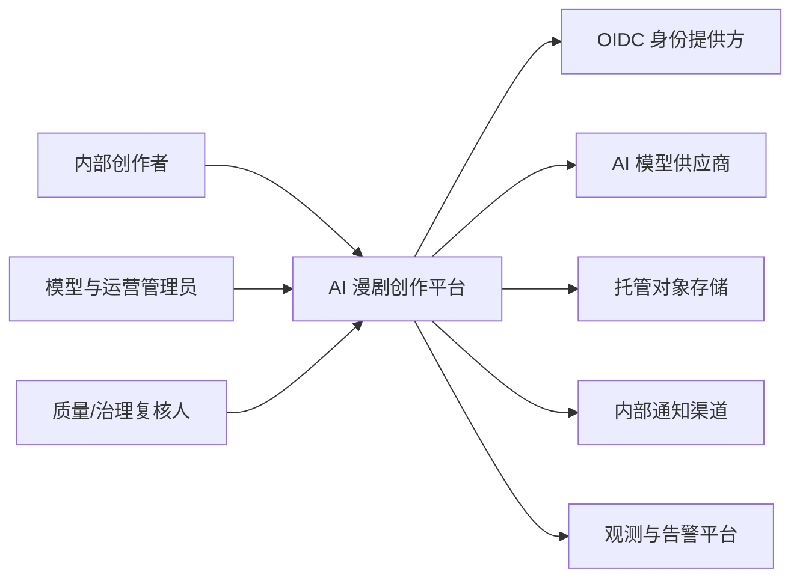
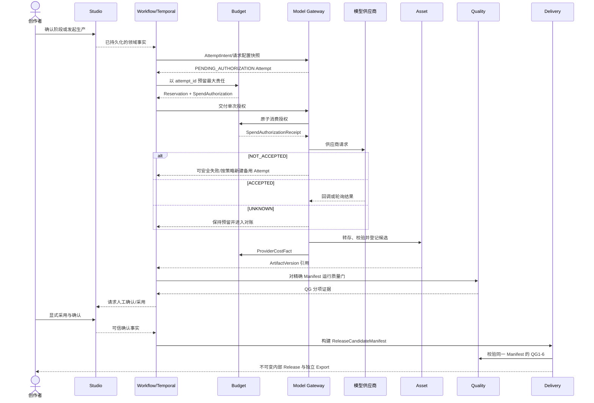
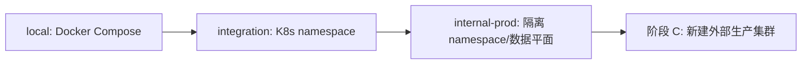

---
tags:
  - ai-video
  - 架构设计
  - 系统设计
date: 2026-07-14
title: AI 漫剧创作平台系统架构说明
status: final
---

# AI 漫剧创作平台系统架构说明

## 1. 架构目标

本架构支撑 AI 漫剧从 idea、故事、分镜、动态视频、声音与后期到内部验证版本的完整生产闭环。平台同时守住三条线：质量证据可追溯、长流程可恢复、任何新增付费任务不越过已批准预算。

主契约见 [ARCHITECTURE-SPINE.md](./ARCHITECTURE-SPINE.md)。本文用于团队理解系统边界，不替代其中 AD 决策。

## 2. C4 Context

## 3. C4 Container 与事实所有权

| 容器 | 拥有的事实 | 不拥有 |
| --- | --- | --- |
| Web BFF | Session、面向 Web 的聚合响应 | 作品阶段、预算、采用版本 |
| Studio | Project、创作 Revision、创作宪法、Gate/Approval、项目阶段 | Workflow 游标、模型任务、成本账本 |
| Workflow | WorkflowRun、Saga 游标、等待与补偿 | 项目/预算/资产/质量/Release 真相 |
| Budget | Quote 验证、Reservation、Ledger、BudgetLimitRevision | 模型提交、项目阶段 |
| Asset | AssetSlot、ArtifactVersion、Adoption、媒体血缘与删除状态 | 质量判定、Release |
| Model Gateway | ModelProfile/Snapshot、Attempt、ModelTask、ProviderCostFact、供应商对账 | 预算可用额、资产采用 |
| Quality | RuleSet、QualityRun、Finding、Evidence、ReviewDecision | 创作事实、采用、Release |
| Delivery | ReleaseCandidateManifest、ReleaseVersion、ExportRecord | 资产采用、质量规则 |
| Experience Projection | ProjectExperienceView、任务/通知派生视图 | 任何业务写模型、read/ack 事实 |

## 4. 核心生产时序

## 5. 关键状态边界

- `Project.phase` 表示创意、故事、视觉、制作、后期、成片；`Project.lifecycle` 表示 ACTIVE、AWAITING_CONFIRMATION、PAUSED、BLOCKED、COMPLETED、ABANDONED。两者不得合并。
- Attempt、Reservation、ModelTask、QualityRun、ReleaseVersion 各自维护自己的状态机，跨域只能通过命令和事实事件协作。
- 用户看到的进度来自事实状态和工作流投影，不用虚假的单一百分比覆盖等待确认、预算阻断或供应商未知状态。
- AI 共创输入先形成 ChangeProposal/ImpactPlan，只有用户显式确认且版本与报价仍有效时才允许预留并启动付费任务。
- 上游修改通过 DependencyManifest 计算影响范围；画面、音轨、字幕等关联资产以 AdoptionManifest 原子采用，避免半新半旧时间线。

## 6. Web 读模型与通知

Web 工作台只读取 `experience-projection` 生成的统一 `ProjectExperienceView`，由领域事件投影 phase、lifecycle、面向用户的状态、待决策、预览和预算三段金额。实时更新采用带游标的 SSE 或等价机制，断线后先加载快照再续传。跨作品任务与站内提醒投影相同 DecisionTaskRef；用户 read/ack 由 Studio 的 InteractionReceipt 持久化，投影可从事件重建。

## 7. 安全与数据治理

- 浏览器只持有安全 Session Cookie；OIDC token 留在 BFF。
- 内部服务调用携带短期服务或委托身份；领域服务以可信 `workspace_id` 执行资源级授权。
- 模型密钥、对象存储凭证和数据库凭证进入 Secret Manager，不进入 Nacos 明文或日志。
- 真实人物肖像、可识别声音和授权材料按敏感数据处理；只有条款获批的供应商可接收。
- 项目删除通过跨 Studio、Asset、Model Gateway 的可验证 Saga 完成，并记录平台删除和供应商删除结果。
- 敏感素材提交前必须锁定 DataPolicySnapshot，并由 Model Gateway 校验供应商禁训练、保留、删除传播和区域资格；平台敏感原始素材删除目标为 30 天，内部审计至少保留 180 天。

## 8. 部署与恢复

integration 与 internal-prod 可以在内部阶段共享物理集群，但不能共享数据库、Kafka Topic、Temporal Namespace、对象存储 Bucket 或 Secret。核心 API 与 Temporal 关键角色多副本，Temporal persistence/visibility 使用独立 schema 与账号；MySQL 使用 HA、binlog 与 PITR，业务元数据目标为 `RPO ≤ 5 分钟`、`RTO ≤ 2 小时`。恢复、滚动升级和回滚目标必须通过演练而非配置声明验证。

ag-core 的规范来源是 `https://github.com/aif-go/ag-core.git`，Go module 为 `github.com/aif-go/ag-core`。Story 1.1 必须从规范远端可达提交或受审 PR merge SHA 中选择发布候选，先完成 clean build 与 provenance preflight，再发布受保护的不可变 GitHub tag/ref，并从该 ref 重建 aggo、gendb 和全部 protoc 生成器。本机 checkout 仅用于调查差异，不决定发布候选；GitLab 版框架与工具不在本项目范围内。

## 9. 实施顺序约束

1. 先从规范远端可达提交或受审 PR merge SHA 中选择 GitHub ag-core 候选，通过 clean build/provenance preflight 后发布受保护的不可变 ref，从该 ref 重建 aggo、gendb 与全部 protoc 生成器，再验证中间件兼容、Seedance API 合约、Temporal/MySQL、agsarama/Kafka、对象存储与回调安全。
2. 建立统一 ID、事件 Envelope、Proto 兼容性测试、Outbox/Inbox 和观测上下文。
3. 优先打通单个视频 Attempt 的 Quote → Reservation → Submit → Reconcile → Asset → Quality → Adoption 闭环。
4. 再扩展故事、声音、后期与 Release；任何阶段都不能绕过预算、质量和显式采用边界。

## 10. 未决但不阻塞架构的事项

- Seedance 2.0 的生产 API、计费和删除语义。
- 锁定 GitHub ag-core commit 对应的 Kafka、Nacos、Redis 精确兼容版本，并替换当前旧 GitLab 工具链。
- OIDC IdP、托管对象存储与 Secret Manager 的具体产品。
- 外部商业化的支付、套餐、渠道发布和治理 SLA。
